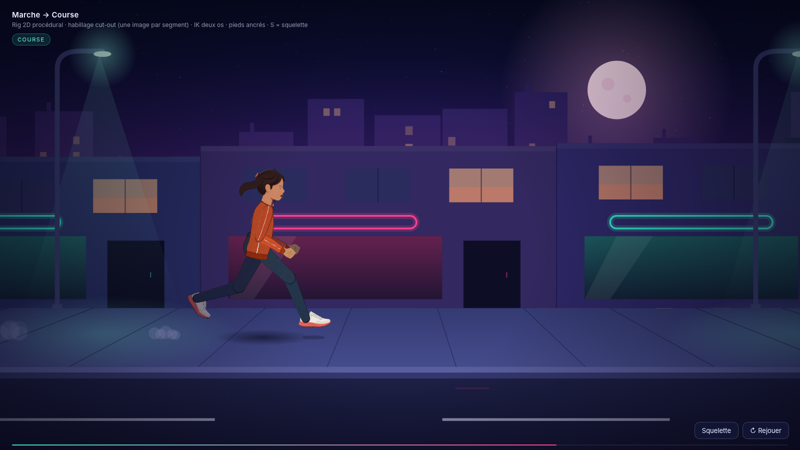
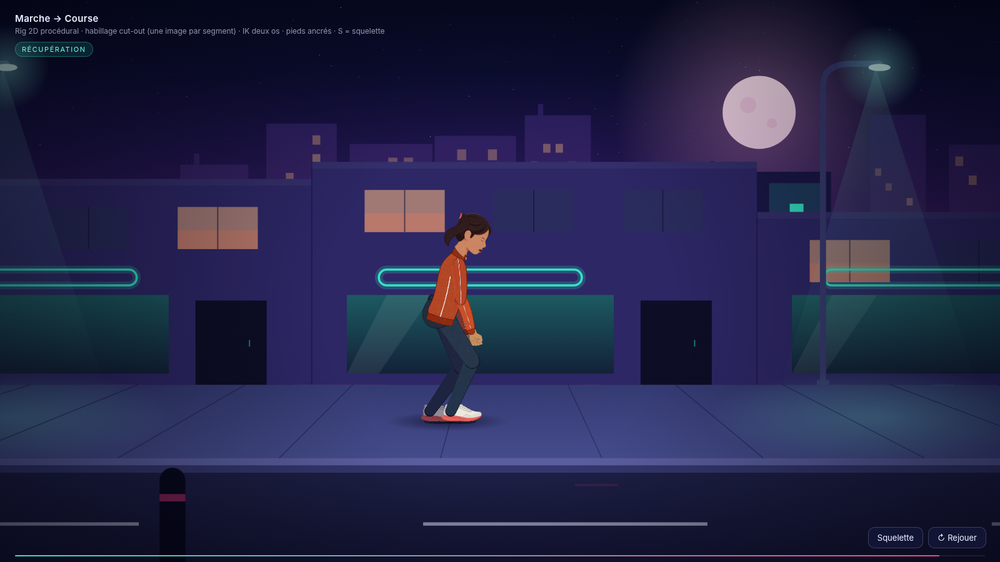
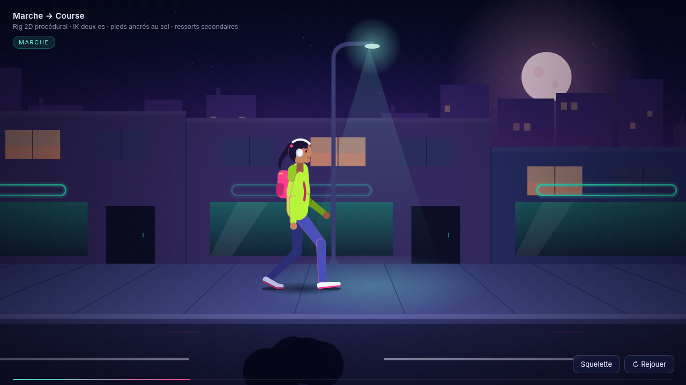
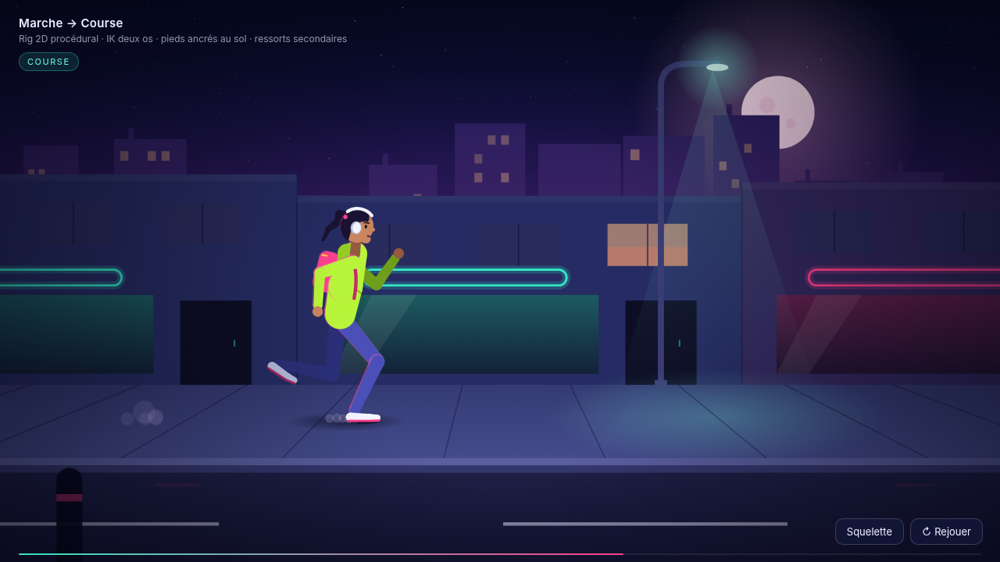

# js-limit-course

Cycle de marche puis course d'un personnage 2D en canvas 2D, rig entierement procedural, habille facon cut-out (papier decoupe) avec de vraies images.

- Rig articule : IK deux os pour les jambes, pieds ancres au sol en appui (zero glissement), deroule talon/pointe
- Allure pilotee par la vitesse : cadence, longueur de pas, facteur d'appui (62 % marche -> 31 % course, phase de vol)
- Poids : bassin en pendule inverse a la marche, ressort-masse a la course, contrainte de portee de jambe
- Anticipation (accroupi + recul avant le depart et avant la course), freinage avec pied pose en avant et buste en arriere, recuperation essoufflee
- Ressorts secondaires : buste, tete, bras, queue de cheval en Verlet
- Rue de nuit avec 7 plans de parallaxe et sol en perspective

## Habillage cut-out

Une image PNG detouree par segment, dans `assets/cutout/` : tete, cou, torse (veste), bassin, cuisse, tibia (jean),
chaussure (coupee en deux au pli metatarsien pour le deroule), bras, avant-bras, main, queue de cheval, et pour le visage
oeil ouvert, paupiere fermee, bouche fermee / entrouverte / grande ouverte (clignement et halètement pendant la recuperation).
Articulations invisibles : cuisse+tibia et bras+avant-bras ne sont plus deux pieces mais une seule bande continue
par membre (`leg.png`, `arm.png`, construites par `tools/joints.py` a partir des pieces d origine : contour sombre retire,
teinte du segment distal recalee sur le proximal, largeurs raccordees au genou/coude, fondu sur la jointure).
Au rendu, la bande est pliee autour du genou/coude par un skinning 2D (tranches fines tournant d un angle interpole
autour du pivot) : le tissu se courbe au lieu de se casser. Chaque membre est compose hors ecran puis entoure d un
seul contour (dilatation de la silhouette de l union), efface pres de l epaule et de la hanche ; la calotte de hanche/epaule
est fondue en alpha et rognee a la silhouette interieure du bassin/torse pour ne jamais deborder. Ordre : bras et
jambe du fond (assombris), bassin, jambe avant, cou, veste, tete, bras avant.

Images generees avec Agnes (`agnes-image-2.5-flash`), une piece par prompt avec un prefixe de style commun
(« paper craft cut-out puppet part … solid chroma green background ») et des couleurs fixees
(veste orange brule a liseré blanc, jean bleu marine, baskets blanches a semelle corail). Detourage par chroma key
numpy/scipy (distance au vert, erosion de frange, despill), alignement de l'axe principal par ACP, teinte du cou et de la
queue de cheval recalee sur la tete.

Touche S ou bouton « Squelette » : version non habillee (rendu procedural d'origine) + rig. Boucle de 16 s, bouton Rejouer.
`?t=11.2` fige le temps (captures), `?sk=1` force le squelette.

Rendu procedural d origine, avant habillage (toujours visible via le mode Squelette) :

